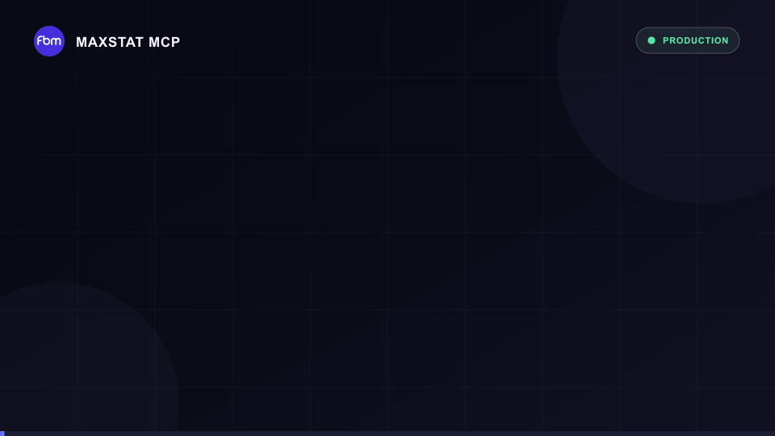

# MaxStat MCP

[](https://modelcontextprotocol.io/)
[](#все-21-инструмент)
[](CHANGELOG.md)
[](LICENSE)
[](https://registry.modelcontextprotocol.io/v0/servers?search=io.github.fbmdata%2Fmaxstat-mcp)
[](https://glama.ai/mcp/connectors/io.github.fbmdata/maxstat-mcp)

**Официальный удалённый MCP-сервер MaxStat для поиска, аналитики и мониторинга
каналов и публикаций в мессенджере MAX.**

Разработчик и оператор: **ООО «ФБМ Аналитикс» / FBM Analytics**.

[Русский](#русский) · [English](#english)

[Инструкция для AI-установщика](llms-install.md)



> MaxStat размещает и обслуживает MCP-сервер. В репозитории опубликованы
> манифесты, плагины, аналитический skill, клиентские конфигурации и
> документация. Серверная реализация и данные MaxStat не являются открытым
> исходным кодом.

## Русский

### Что именно можно получить через MaxStat MCP

AI-агент подключается к живому индексу каналов и публикаций MAX и получает
структурированные данные, а не фрагменты поисковой выдачи или вручную собранные
скриншоты.

| Область             | Какие данные возвращает MCP                                                                                                                 |
| ------------------- | ------------------------------------------------------------------------------------------------------------------------------------------- |
| Поиск каналов       | Название, описание, URL, категория, тип доступа, диапазоны аудитории и числа публикаций, сортировка по релевантности, дате или аудитории    |
| Карточка канала     | ID, название, описание, аватар, URL, публичный или закрытый доступ, подписчики, публикации, категории, даты и статус РКН, когда он доступен |
| Динамика аудитории  | Дневные значения, минимум, максимум, абсолютный и процентный рост за выбранный период                                                       |
| Просмотры и реакции | Суммарные, средние и максимальные значения на публикацию и дневная история                                                                  |
| Активность канала   | Число публикаций, дневная история и распределение по тексту, фото, видео, файлам и другим форматам                                          |
| Поиск публикаций    | Полнотекстовый поиск с фильтрами по каналу, формату, датам, просмотрам и реакциям                                                           |
| Карточка публикации | Текст, URL, тип, вложения, просмотры, сумма и разбивка реакций, даты и источник пересылки                                                   |
| История публикации  | Дневные значения просмотров и реакций                                                                                                       |
| Пересылки           | Найденные репосты, их URL, даты и ID каналов назначения                                                                                     |
| Мониторинг          | Webhook на новые публикации канала или новые публикации по ключевому слову и категории                                                      |
| Тариф и расход      | Статус тарифа, период, включённые, купленные, использованные и оставшиеся кредиты и история списаний                                        |

Также можно добавить публичный или доступный по приглашению канал MAX в очередь
отслеживания MaxStat.

### Проверенный масштаб индекса

| Проверено 28 июля 2026 года |   Живой индекс |
| --------------------------- | -------------: |
| Каналы MAX                  |    **367 759** |
| Публикации                  | **85 720 012** |
| Категории каналов           |         **42** |
| MCP-инструменты             |         **21** |

Индекс постоянно растёт. Используйте `search_channels`, `search_posts` и
`get_categories`, чтобы получить актуальные результаты.

### Быстрый старт

1. Создайте токен в
   [личном кабинете MaxStat API](https://maxstat.ru/dashboard/api).
2. Не публикуйте токен и не добавляйте его в Git.
3. Выберите платформу ниже.
4. Перезапустите клиент и проверьте, что доступны 21 инструмент MaxStat.

| Параметр             | Значение                     |
| -------------------- | ---------------------------- |
| Endpoint             | `https://maxstat.ru/api/mcp` |
| Транспорт            | Streamable HTTP              |
| Авторизация          | API-токен                    |
| Заголовок            | `X-API-Token: <API_TOKEN>`   |
| Переменная окружения | `MAXSTAT_API_TOKEN`          |

### Установка по платформам

| Платформа               | Способ                                                  |
| ----------------------- | ------------------------------------------------------- |
| Codex / ChatGPT desktop | Репозиторий-маркетплейс и нативный Codex-плагин         |
| Claude Code             | Claude-compatible marketplace                           |
| VS Code                 | Agent Plugins marketplace или прямой `.vscode/mcp.json` |
| GitHub Copilot CLI      | Общий Claude/Copilot marketplace                        |
| Gemini CLI              | Gemini extension с защищённой настройкой токена         |
| Cursor                  | Установка по ссылке или `~/.cursor/mcp.json`            |
| Windsurf                | `~/.codeium/windsurf/mcp_config.json`                   |
| JetBrains AI Assistant  | MCP-настройки IDE                                       |
| Claude Desktop          | Локальный мост `mcp-remote`                             |
| Cline                   | Удалённый Streamable HTTP из `llms-install.md`          |
| Другие клиенты          | Универсальный Streamable HTTP JSON                      |

#### Codex

До запуска Codex сохраните токен в окружении:

```bash
export MAXSTAT_API_TOKEN="<API_TOKEN>"
```

Добавьте marketplace и установите плагин:

```bash
codex plugin marketplace add fbmdata/maxstat-mcp
codex plugin add maxstat@maxstat-plugins
```

Плагин подключает MCP с правильным пользовательским заголовком
`X-API-Token`. Не используйте Bearer-настройку: она отправляет другой заголовок
и не подходит для MaxStat.

Для прямой установки без плагина объедините
[`configs/codex.toml`](configs/codex.toml) со своим
`~/.codex/config.toml`:

```toml
[mcp_servers.maxstat]
url = "https://maxstat.ru/api/mcp"
env_http_headers = { "X-API-Token" = "MAXSTAT_API_TOKEN" }
```

#### Claude Code

```bash
export MAXSTAT_API_TOKEN="<API_TOKEN>"
claude plugin marketplace add fbmdata/maxstat-mcp
claude plugin install maxstat@maxstat-plugins
```

Прямая конфигурация находится в
[`configs/claude-code.json`](configs/claude-code.json).

#### Visual Studio Code

Добавьте marketplace в `settings.json`:

```json
{
  "chat.plugins.marketplaces": ["fbmdata/maxstat-mcp"]
}
```

Откройте Extensions, найдите `@agentPlugins`, выберите `MaxStat MCP` и нажмите
Install. Для прямого подключения скопируйте
[`configs/vscode.json`](configs/vscode.json) в `.vscode/mcp.json`: VS Code
безопасно запросит токен через password input.

#### GitHub Copilot CLI

```bash
export MAXSTAT_API_TOKEN="<API_TOKEN>"
copilot plugin marketplace add fbmdata/maxstat-mcp
copilot plugin install maxstat@maxstat-plugins
```

Claude Code, VS Code и GitHub Copilot CLI используют один совместимый плагин,
skill и MCP-конфигурацию.

#### Gemini CLI

```bash
gemini extensions install https://github.com/fbmdata/maxstat-mcp
```

Расширение запросит `MAXSTAT_API_TOKEN` как чувствительную настройку и подключит
его к заголовку `X-API-Token`. Инструкции Gemini находятся в
[`GEMINI.md`](GEMINI.md).

#### Cursor

[](https://cursor.com/en/install-mcp?name=maxstat&config=eyJ1cmwiOiJodHRwczovL21heHN0YXQucnUvYXBpL21jcCIsImhlYWRlcnMiOnsiWC1BUEktVG9rZW4iOiIke2VudjpNQVhTVEFUX0FQSV9UT0tFTn0ifX0%3D)

Перед запуском Cursor задайте `MAXSTAT_API_TOKEN`, затем нажмите кнопку выше.
Альтернатива: объедините
[`configs/cursor.json`](configs/cursor.json) с `~/.cursor/mcp.json`.

#### Cline

Задайте `MAXSTAT_API_TOKEN` до запуска Cline и передайте агенту
[`llms-install.md`](llms-install.md). Файл содержит конфигурацию удалённого
Streamable HTTP-сервера и проверку подключения. Локальный npm-пакет не нужен:
MaxStat размещает и обслуживает сервер на `https://maxstat.ru/api/mcp`.

#### Windsurf

Задайте `MAXSTAT_API_TOKEN` до запуска Windsurf и объедините
[`configs/windsurf.json`](configs/windsurf.json) с
`~/.codeium/windsurf/mcp_config.json`. Конфигурация использует нативную
подстановку `${env:MAXSTAT_API_TOKEN}`.

#### JetBrains AI Assistant

Откройте **Settings → Tools → AI Assistant → Model Context Protocol (MCP)**,
добавьте HTTP-конфигурацию из
[`configs/jetbrains.json`](configs/jetbrains.json) и замените `<API_TOKEN>`
локально в IDE. JetBrains пока не документирует подстановку переменной
окружения в MCP headers, поэтому placeholder оставлен намеренно.

#### Claude Desktop

Облачный custom connector Claude не принимает произвольный пользовательский
`X-API-Token`. До внедрения OAuth 2.1 используйте локальный мост из
[`configs/claude-desktop.json`](configs/claude-desktop.json). Требуются
Node.js и npm; токен сохраняется только в локальной конфигурации Claude
Desktop.

#### Универсальная конфигурация

Используйте [`configs/generic-mcp.json`](configs/generic-mcp.json):

```json
{
  "mcpServers": {
    "maxstat": {
      "type": "streamable-http",
      "url": "https://maxstat.ru/api/mcp",
      "headers": {
        "X-API-Token": "<API_TOKEN>"
      }
    }
  }
}
```

### Все 21 инструмент

#### Поиск и каталог

| Инструмент        | Что возвращает или делает                                        |   Кредиты |
| ----------------- | ---------------------------------------------------------------- | --------: |
| `get_categories`  | Категории и актуальное количество каналов в каждой категории     | Бесплатно |
| `search_channels` | Отфильтрованные, отсортированные и постраничные карточки каналов |         3 |
| `get_channel`     | Полная карточка одного канала по идентификатору                  |         1 |
| `add_channel`     | Добавляет публичный или invite-only канал в очередь              | Бесплатно |
| `search_posts`    | Отфильтрованные, отсортированные и постраничные публикации       |         3 |

#### Аналитика каналов

| Инструмент                | Что возвращает                                                    | Кредиты |
| ------------------------- | ----------------------------------------------------------------- | ------: |
| `get_channel_subscribers` | Минимум, максимум, абсолютный и процентный рост и дневную историю |       5 |
| `get_channel_views`       | Суммарные, средние и максимальные просмотры и дневную историю     |       5 |
| `get_channel_likes`       | Суммарные, средние и максимальные реакции и дневную историю       |       5 |
| `get_channel_posts`       | Число публикаций, форматы и дневную историю активности            |       5 |

#### Аналитика публикаций

| Инструмент       | Что возвращает                                                     | Кредиты |
| ---------------- | ------------------------------------------------------------------ | ------: |
| `get_post`       | Контент, вложения, метрики, источник пересылки и найденные репосты |       1 |
| `get_post_views` | Текущее число просмотров и дневную историю                         |       5 |
| `get_post_likes` | Общее число реакций, разбивку по типам и дневную историю           |       5 |

#### Webhook-мониторинг

| Инструмент                    | Что возвращает или делает                                       |                           Кредиты |
| ----------------------------- | --------------------------------------------------------------- | --------------------------------: |
| `create_channel_subscription` | Подписывает публичный HTTPS callback на новые публикации канала | Создание бесплатно; 2 за доставку |
| `create_keyword_subscription` | Подписывает callback на публикации по запросу и категории       | Создание бесплатно; 3 за доставку |
| `get_subscriptions`           | Список подписок с фильтрами по статусу и типу                   |                         Бесплатно |
| `get_subscription`            | Одна подписка, состояние доставки и последняя ошибка            |                         Бесплатно |
| `update_subscription`         | Изменение callback URL, пауза или возобновление                 |                         Бесплатно |
| `delete_subscription`         | Удаление webhook-подписки                                       |                         Бесплатно |

Webhook должен быть доступен по публичному HTTPS-адресу.

#### Тариф и использование

| Инструмент                 | Что возвращает                                             |   Кредиты |
| -------------------------- | ---------------------------------------------------------- | --------: |
| `get_account_subscription` | Тариф, статус, период и состояние кредитов                 | Бесплатно |
| `get_account_limits`       | Включённые, купленные, использованные и оставшиеся кредиты | Бесплатно |
| `get_account_usage`        | Постраничную историю списаний по запросам                  | Бесплатно |

### Пример на реальных данных

Проверочный запрос 28 июля 2026 года вернул:

- канал **MAX • Анонсы** с аудиторией 3 446 649 подписчиков;
- рост с 3 040 777 до 3 446 649 с 29 июня по 28 июля:
  **+405 872 / +13,3%**;
- публикацию с **17 719 253 просмотрами** и **185 992 реакциями**;
- разбивку реакций, дневные истории просмотров и реакций;
- список найденных пересылок.

Значения показывают структуру реального ответа и не являются обещанием
фиксированных показателей продукта.

### Примеры запросов

```text
Найди 20 технологических каналов MAX с максимальным приростом подписчиков за
последние 30 дней. Верни ссылки, текущую аудиторию и процент роста.
```

```text
Сравни пять каналов по аудитории, средним просмотрам, реакциям, частоте
публикаций и распределению форматов.
```

```text
Найди публикации об ипотеке за июль. Верни ссылки, текст, вложения, просмотры,
детальные реакции и найденные пересылки.
```

```text
Подпиши webhook на новые публикации со словами «искусственный интеллект» в
категории «Технологии».
```

```text
Покажи мой тариф MaxStat, остаток кредитов и десять последних списаний.
```

### Тарифы и безопасность

MCP входит во все [тарифы MaxStat API](https://maxstat.ru/promo/api) без
дополнительной оплаты. MCP и прямые вызовы API используют единый баланс
кредитов. Test Drive активируется при первом API-запросе и предоставляет
1 000 кредитов каждые 30 дней.

Никогда не публикуйте настоящий API-токен в issue, PR, конфигурации, логе или
скриншоте. Об уязвимостях сообщайте по инструкции из
[`SECURITY.md`](SECURITY.md).

## English

MaxStat MCP gives AI agents structured access to the live MAX messenger channel
and publication index. It supports channel and post discovery, daily audience,
view and reaction histories, publishing activity, attachment and reaction
details, forward detection, webhook monitoring, and account credit usage.

### Connection

| Parameter       | Value                                                        |
| --------------- | ------------------------------------------------------------ |
| Endpoint        | `https://maxstat.ru/api/mcp`                                 |
| Transport       | Streamable HTTP                                              |
| Header          | `X-API-Token: <API_TOKEN>`                                   |
| Token dashboard | [maxstat.ru/dashboard/api](https://maxstat.ru/dashboard/api) |

### Install

#### Codex

```bash
export MAXSTAT_API_TOKEN="<API_TOKEN>"
codex plugin marketplace add fbmdata/maxstat-mcp
codex plugin add maxstat@maxstat-plugins
```

#### Claude Code

```bash
export MAXSTAT_API_TOKEN="<API_TOKEN>"
claude plugin marketplace add fbmdata/maxstat-mcp
claude plugin install maxstat@maxstat-plugins
```

#### GitHub Copilot CLI

```bash
export MAXSTAT_API_TOKEN="<API_TOKEN>"
copilot plugin marketplace add fbmdata/maxstat-mcp
copilot plugin install maxstat@maxstat-plugins
```

#### Gemini CLI

```bash
gemini extensions install https://github.com/fbmdata/maxstat-mcp
```

For VS Code, Cursor, Windsurf, JetBrains AI Assistant, Claude Desktop, and
generic clients, use the checked-in [`configs/`](configs/) directory. The
Russian section above contains detailed client-specific instructions.

### Capabilities

- Search and filter MAX channels and publications.
- Retrieve channel profiles, audience growth, views, reactions, activity, and
  content-format mix.
- Retrieve post text, attachments, metrics, reaction details, histories, and
  detected forwards.
- Create and manage channel or keyword webhook subscriptions.
- Inspect the active MaxStat plan, credit balance, and request-level usage.

The complete 21-tool contract and credit costs are documented in
[Все 21 инструмент](#все-21-инструмент).

### Authentication boundary

This release supports clients that can send the custom `X-API-Token` header.
Publishing as a fully hosted ChatGPT or Claude cloud connector requires a
separate OAuth 2.1 implementation.

## Ссылки / Links

- [MaxStat MCP](https://maxstat.ru/promo/mcp)
- [Получить API-токен / Get a token](https://maxstat.ru/dashboard/api)
- [Документация API / API documentation](https://maxstat.ru/api/docs)
- [Тарифы API / API plans](https://maxstat.ru/promo/api)
- [ООО «ФБМ Аналитикс» / FBM Analytics](https://fbmdata.ru)
- [MaxStat Insights в MAX](https://max.ru/maxstat)
- [FBM API Insights в Telegram](https://t.me/fbmapi)

## Лицензия / License

MIT распространяется только на опубликованные в этом репозитории манифесты,
плагины, skill, конфигурации, документацию и вспомогательные проверки. Лицензия
не распространяется на сервис MaxStat, API, данные, базы данных, товарные знаки
и серверную реализацию. Подробности приведены в [`NOTICE`](NOTICE).
